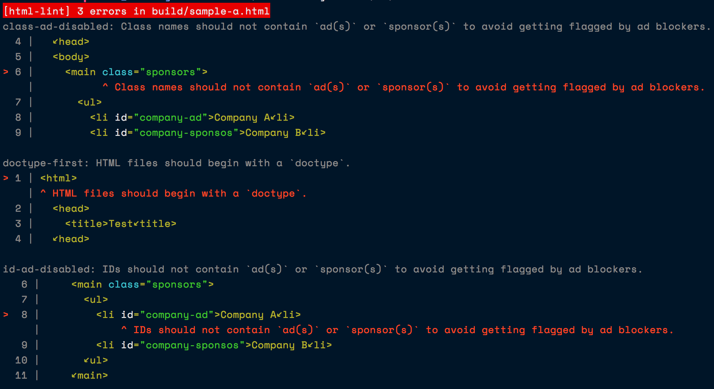

# html-lint

> A meaningful static analysis tool for HTML

html-lint is a linter for HTML files. It uses
[reshape](https://github.com/reshape/reshape) to analyse
your HTML and provides feedback to make your HTML better.

## Features

* Only meaningful rules
* Fully extensible using custom rules
* Contextual feedback

## Installation

```bash
yarn add -D @coyote-labs/html-lint
```

## Usage

```bash
node_modules/.bin/html-lint build/**/*.html
```

You can also use this programmatically.

```js
const { htmlLint } = require('@coyote-labs/html-lint');

(async() => {
  try {
    // it accepts glob patterns or an array of file paths.
    await htmlLint('dist/*.html');
  } catch (error) {
    console.log(error)
  }
})();
```



## Configuration

### Project Level

html-lint loads the following configuration files if they are present:

* An `html-lint` property in package.json.
* A `.html-lintrc` file in JSON or YAML format.
* A `.html-lintrc.json`, `.html-lintrc.yaml`, `.html-lintrc.yml`,
  or `.html-lintrc.js` file.
* A `.html-lint.config.js` file exporting a JS object.

The configuration file can be used to toggle rules. The allowed levels
are `on`, `off` and `warn`.

For example,

```js
{
  'doctype-first': 'on',
  'class-ad-disabled': 'off',
  'src-not-empty': 'warn'
}
```

You can also use this file to configure [custom rules](extending.md), if any.

```js
{
  'class-ad-disabled': 'off',
  'custom-rules': {
    'dir': 'my-custom-rules',
    'rules': {
      'custom-rule-one': 'error',
      'custom-rule-two': 'warn'
    }
  }
}
```

### File Level

File level rule configuration is also possible. For example,

```html
<!-- html-lint doctype-first:warn, id-ad-disabled:off -->
<html>
  <head>
    <title>Hello</title>
  </head>
  <body>
    <main class="sponsors">
      <ul>
        <li id="company-ad">Company A</li>
        <li id="company">Company B</li>
      </ul>
    </main>
  </body>
</html>
```
